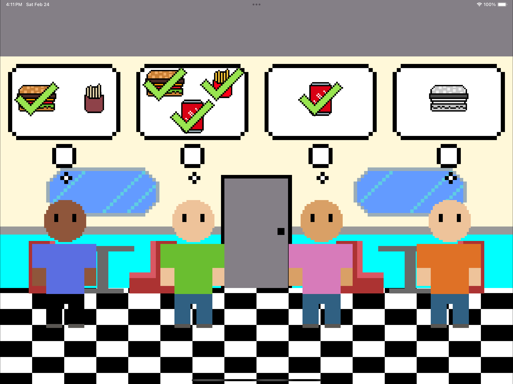

# Super Scheduler
This repository contains my entry for the 2024 Swift Student Challenge. 

Although it was not selected, I enjoyed the oppourtunity to practice my Swift skills while creating pixel art for the first time! All pixel art is created by myself.

I used Swift and SpriteKit to create a fun and engaging animated lesson that teaches the basics of three CPU scheduling algorithms: First In First Out (FIFO), Shortest Time to Completion First (STCF), and Round Robin (RR).

# How to run
Download the `.swiftpm` from the Releases tab and follow the instructions there!
